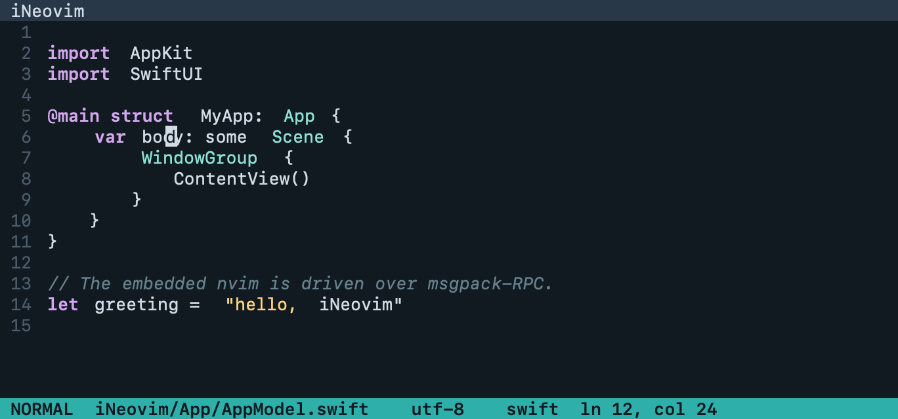

# iNeovim

一款追求完全 Mac 原生体验的 Neovim GUI。

## 项目简介

iNeovim 嵌入 Neovim,并将其 UI 渲染为一流的 macOS 应用。目标不是简单地把
Neovim 包进一个窗口,而是做出最好的 Neovim GUI——用起来与原生 Mac 应用无异。



任务计划的九个阶段均已完成,详见下方 **当前状态**。

## 目标

iNeovim 追求完整的 Mac 原生体验,包括:

- **原生渲染**——达到 Apple 自家应用水准的文字渲染质量
- **平滑滚动与流畅动画**——惯量滚动、光标与视觉反馈,无撕裂、无抖动
- **系统级字体渲染**——通过 Core Text 实现正确的字距、合字与 Retina 级抗锯齿
- **原生键盘体验**——macOS 键盘事件处理与原生快捷键
- **系统集成**——输入法(IME)、Emoji 表情面板等 macOS 服务,与任何原生应用一致

## 架构

iNeovim 嵌入一个 Neovim 实例并实现其 GUI 协议:

- **Neovim 嵌入**——Neovim 以子进程方式通过 `nvim --embed` 启动,GUI 通过
  msgpack-RPC API 与其通信。
- **RPC 层**——手写的小型 MessagePack codec(不引入第三方依赖;msgpack-RPC
  只需要很小的类型子集,另加 ext 类型表示 buffer/window/tabpage 句柄)。
  并发模型基于 actor 和 async/await:
  - `NvimProcess` 负责子进程生命周期(启动、stdio pipes、退出)。
  - `MsgPackCodec` 是无状态的增量解码器——stdio 上的 msgpack-RPC 没有长度
    前缀,收到字节先入缓冲区,再逐个对象解析。
  - `RPCSession`(actor)按 msgid 将响应与请求配对,通过 checked
    continuation 实现 `func call(_:params:) async throws`,并分发通知。
  - `NvimClient` 在其上提供类型化 API,把 `redraw` 通知转成强类型事件的
    `AsyncStream`(`gridLine`、`gridScroll`、`cursorGoto`……),渲染层不需要
    接触原始 msgpack。
  - RPC 层不运行在主 actor 上,读循环和 redraw 流量不会阻塞 UI。
- **AppKit + SwiftUI 混合 UI 层**:
  - **AppKit** 通过自定义 `NSView` 渲染编辑器网格,使用 **Core Text + CALayer**
    (不用 Metal)。选择 AppKit 是为了渲染性能:文本网格的重绘频率很高(滚动、
    光标闪烁、动画),AppKit 自定义 View 能直接掌控绘制管线,这是 SwiftUI
    做不到的。
  - **SwiftUI** 负责应用外壳——窗口、标签页、设置等外围 UI,通过
    `NSViewRepresentable` 桥接到 AppKit 渲染视图。
- **输入处理**——`NSEvent` 翻译层保持薄而完备:
  - *键盘*:`keyDown(with:)` 翻译成 Neovim 键码记法(`nvim_input`),用
    `charactersIgnoringModifiers` 加 modifier 状态自行组装(避免 Ctrl 组合
    变成控制字符)。Cmd 遵循 macOS 惯例——`performKeyEquivalent` 先服务
    App 自身快捷键,其余 Cmd 组合可选透传为 `<D->`。Option 可配置为
    Meta(`macosOptionAsMeta`)或保持系统字符行为。
  - *IME*:渲染 View 实现完整的 `NSTextInputClient` 协议。预编辑文本
    (marked text)由 GUI 在光标处绘制(带下划线),`insertText` 时才发给
    Neovim;`firstRect(forCharacterRange:)` 返回光标在屏幕上的精确位置,
    使输入法候选窗贴住光标。
  - *鼠标*:按下/拖拽/抬起映射到 `nvim_input_mouse`(拖拽即可视选择)。
  - 输入组织为 `KeyInputHandler`、`IMEHandler`、`MouseHandler`、
    `ScrollController` 四个组件,汇入统一的 `InputEvent` 流进入
    `NvimClient`。
- **滚动与动画策略**——Neovim 网格是按行离散的,像素级平滑滚动由 GUI 侧
  合成:逻辑滚动走 Neovim,视觉插值走 Core Animation。
  - 触控板的 delta 与阶段(`NSEventPhase` began/changed/ended/momentum)
    直接驱动滚动;传统滚轮的动量由 GUI 补出。
  - 网格内容放在一个 `CALayer` 中,像素偏移由 `CADisplayLink` 驱动的动画
    更新——纯视觉层,不触碰 Neovim。
  - 累积的像素 delta 折算成整行发给 Neovim;`grid_scroll` 事件到达时更新
    网格内容。偏移做限幅(最多领先一屏),快速滚动不会越过内容滚出空白。
  - 光标移动用短动画(~50–100ms)插值滑动,而不是瞬移跳变。

```
┌──────────────────────────────────────┐
│  SwiftUI 外壳(窗口、标签页等)      │
│  ┌────────────────────────────────┐  │
│  │ AppKit NSView(编辑器网格)     │  │
│  │ Core Text + CALayer 渲染       │  │
│  └──────────────┬─────────────────┘  │
│                 │ msgpack-RPC        │
│  ┌──────────────▼─────────────────┐  │
│  │ nvim --embed(子进程)          │  │
│  └────────────────────────────────┘  │
└──────────────────────────────────────┘
```

## 当前状态

任务计划的第 1–9 阶段已实现。应用内嵌 `nvim --embed`,用 Core Text + `CALayer`
渲染 linegrid UI,处理键盘/输入法/鼠标输入,提供平滑滚动与光标动画,并具备原生
应用外壳(Neovim tabpage、设置窗口、File/Neovim 菜单、由 `set_title` 驱动的窗口
标题、打开方式/拖拽打开文件,以及崩溃恢复与原地重启)。第 9 阶段新增应用图标、
`com.mzevo` bundle ID、MIT 许可证、性能基线与 Instruments signpost,以及文档化的
公证与发布流程。

测试覆盖编解码、redraw 解析、UI 状态、输入、滚动、设置、崩溃恢复、渲染冒烟测试
以及内嵌 `:terminal` 冒烟检查。完整计划见 `docs/TASKS.md`,手动检查见
`docs/VERIFICATION.md`,性能见 `docs/PERFORMANCE.md`,发布见 `docs/RELEASE.md`。

## 环境要求

- macOS 14.6 或更高版本
- Neovim 0.9 或更高版本(自动查找可执行文件)
- Xcode 26.3 或更高版本(仅从源码构建时需要)

## 安装

暂无发布二进制,请从源码构建:

1. 安装 Neovim 0.9 或更高版本,例如 `brew install neovim`。
2. 克隆并打开工程:

   ```sh
   git clone https://github.com/daqing/iNeovim.git
   cd iNeovim
   open iNeovim.xcodeproj
   ```

3. 选择 `iNeovim` scheme 并运行(⌘R)。

目前没有命令行构建脚本和 CI。发布构建按 `docs/RELEASE.md` 进行归档、公证并装订。

## 许可证

[MIT](LICENSE) © 2026 David Zhang
